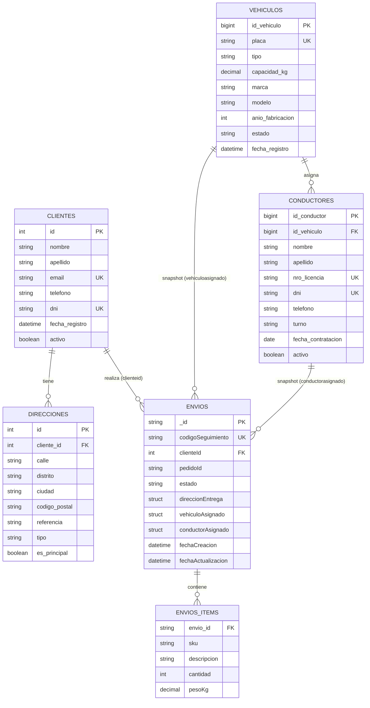

# Microservicio de Analítica — Sistema de Logística y Entregas

## Descripción del microservicio

El **Microservicio de Analítica** (`svc-analytics`) es una API REST responsable de exponer consultas analíticas sobre los datos históricos del sistema de logística, utilizando **AWS Athena** como motor de consulta sobre los archivos CSV depositados en **S3** por la VM de ingesta (`vm-ingesta`).

A diferencia de los demás microservicios, Analítica **no posee base de datos propia ni transaccional**: consulta directamente el **Catálogo de Datos de AWS Glue**, construido sobre los snapshots CSV que la VM de ingesta sube periódicamente desde MySQL (Clientes), PostgreSQL (Vehículos) y MongoDB (Envíos).

El servicio está desarrollado con **Python + FastAPI** y utiliza **PyAthena** para ejecutar las consultas SQL contra el catálogo de Glue, devolviendo los resultados como JSON mediante **pandas**.

---

## Catálogo de datos en AWS Glue

Por cada tabla/colección que la VM de ingesta sube a S3 (`s3://<bucket>/ingesta/<db_name>/<tabla>/`), se define un **Crawler de AWS Glue** independiente que registra esa carpeta como una tabla dentro de la misma base de datos del catálogo (`logistica`):

| Crawler | Origen (ingesta) | Tabla resultante en el catálogo |
|---|---|---|
| `crawler-logis-clientes` | MySQL → `clientes`, `direcciones` | `clientes`, `direcciones` |
| `crawler-logis-vehiculos` | PostgreSQL → `vehiculos`, `conductores` | `vehiculos`, `conductores` |
| `crawler-logis-envios` | MongoDB → `envios` (con `items` normalizado aparte) | `envios`, `envios_items` |

Todas las tablas quedan disponibles en la misma base de datos de Glue (`DATABASE_GLUE`, por defecto `logistica`), lo que permite hacer `JOIN` entre ellas directamente desde Athena, tal como se usa en los endpoints de este microservicio (por ejemplo, `envios` con `clientes`, o `envios` con `direcciones`).

---

## Diagrama Entidad/Relación del catálogo de datos

Este diagrama relaciona **todas las tablas del catálogo de Glue**, incluyendo tanto las tablas relacionales normalizadas (`clientes`, `direcciones`, `vehiculos`, `conductores`) como las tablas derivadas del modelo documental de Envíos (`envios`, `envios_items`), y las relaciones "congeladas" (snapshot) que `envios` mantiene hacia vehículo y conductor.



### Notas sobre las relaciones

- `clientes` → `direcciones`: relación **1:N** real, vía `direcciones.cliente_id`.
- `clientes` → `envios`: relación **1:N** vía `envios.clienteId`, usada por ejemplo en `/analitica/top-clientes-demanda` y `/analitica/reporte-360-operaciones`.
- `envios` → `envios_items`: la colección de MongoDB guarda `items` como un arreglo embebido; el script de ingesta (`ingesta_envios.py`) lo **normaliza en una tabla aparte** (`envios_items`), con `envio_id` como llave para poder hacer `JOIN` desde Athena, ya que Athena no consulta cómodamente arreglos JSON embebidos en una sola celda.
- `vehiculos` → `conductores`: relación **1:N** real (un vehículo puede tener varios conductores asignados a lo largo del tiempo), vía `conductores.id_vehiculo`.
- `vehiculos` / `conductores` → `envios`: **no es una FK relacional real**, sino un **snapshot histórico** embebido dentro del documento de envío (`vehiculoAsignado`, `conductorAsignado`), congelado al momento de crear el envío. Por eso en Athena se accede como `e.vehiculoasignado.tipo`, `e.conductorasignado.nombre`, etc., en vez de un `JOIN` clásico por clave foránea.

---

## Principales endpoints

### Consultas analíticas (sobre tablas base)

| Método | Endpoint | Descripción |
|---|---|---|
| `GET` | `/analitica/envios-por-vehiculo` | Envíos agrupados por tipo de vehículo y estado. |
| `GET` | `/analitica/reporte-ciudades-destino` | Clientes y paquetes totales por ciudad de destino. |
| `GET` | `/analitica/rendimiento-conductores` | Envíos asignados vs. entregados por conductor. |
| `GET` | `/analitica/top-clientes-demanda` | Top 10 clientes con más envíos realizados. |
| `GET` | `/analitica/flujo-origen-destino` | Volumen de envíos entre ciudad de origen y destino (`JOIN` entre `envios` y `direcciones`). |
| `GET` | `/analitica/reporte-360-operaciones` | Vista resumida de operaciones (`JOIN` entre `envios`, `clientes` y `direcciones`). |

### Vistas precreadas en Athena

| Método | Endpoint | Descripción |
|---|---|---|
| `GET` | `/analitica/vista-envios` | Consulta la vista `vista_analitica_envios`. |
| `GET` | `/analitica/vista-reporte-logistica` | Consulta la vista `vista_reporte_logistica`. |

### Estado del servicio

| Método | Endpoint | Descripción |
|---|---|---|
| `GET` | `/` | Verifica que el microservicio se encuentre operativo. |
| `GET` | `/health` | Health check para el load balancer. |

La documentación interactiva está disponible en:

```text
/docs
```

---

## Tecnologías

| Tecnología | Uso |
|---|---|
| **Python 3.10** | Lenguaje principal del microservicio. |
| **FastAPI** | Implementación y exposición de la API REST. |
| **PyAthena** | Cliente de conexión y ejecución de consultas SQL contra AWS Athena. |
| **pandas** | Transformación de resultados de Athena a JSON. |
| **boto3** | Soporte de credenciales/región AWS. |
| **AWS Glue** | Catálogo de datos (crawlers + tablas) sobre los CSV en S3. |
| **AWS Athena** | Motor de consultas SQL serverless sobre el catálogo de Glue. |
| **Amazon S3** | Almacenamiento de los snapshots CSV generados por `vm-ingesta`. |
| **Docker** | Empaquetado y ejecución del microservicio en contenedores. |

---

## Documentación Docker

El microservicio está preparado para ejecutarse dentro de un contenedor Docker basado en **Python 3.10 Slim**. No requiere una base de datos propia, pero **sí necesita credenciales AWS válidas** (Athena, Glue y S3) para funcionar.

### 1. Variables de entorno

```env
AWS_REGION=us-east-1
DATABASE_GLUE=logistica
ATHENA_WORKGROUP=logis-analytics-wg
S3_STAGING_DIR=s3://logis-athena-results-<account-id>/results/
```

| Variable | Descripción |
|---|---|
| `AWS_REGION` | Región de AWS donde viven Glue/Athena/S3. |
| `DATABASE_GLUE` | Nombre de la base de datos del catálogo de Glue (contiene todas las tablas del diagrama ER). |
| `ATHENA_WORKGROUP` | Workgroup de Athena a utilizar. |
| `S3_STAGING_DIR` | Bucket/prefijo S3 donde Athena escribe los resultados de cada consulta. |

Las credenciales de AWS se obtienen del **instance profile del Learner Lab** (`LabInstanceProfile`) cuando corre en producción; en local, exporta `AWS_ACCESS_KEY_ID` / `AWS_SECRET_ACCESS_KEY` o usa `~/.aws/credentials` antes de levantar el contenedor.

### 2. Construir la imagen

```bash
docker build -t svc-analytics .
```

### 3. Ejecutar el contenedor

```bash
docker run -d \
  --name ms-analytics \
  --env-file .env \
  -p 8005:8000 \
  svc-analytics
```

El puerto `8000` corresponde al puerto interno del contenedor y `8005` al puerto utilizado para acceder al servicio desde el host.


### 4. Requisitos previos en AWS

Antes de que este microservicio pueda responder, deben existir:

1. El bucket S3 con los CSV subidos por `vm-ingesta` (`ingesta/<db_name>/<tabla>/<tabla>.csv`).
2. Los **3 crawlers de Glue** ejecutados al menos una vez (`crawler-logis-clientes`, `crawler-logis-vehiculos`, `crawler-logis-envios`), registrando las 6 tablas del diagrama ER en la base de datos `logistica`.
3. El **workgroup de Athena** (`logis-analytics-wg`) y su bucket de resultados creados.
4. (Opcional) Las vistas `vista_analitica_envios` y `vista_reporte_logistica` creadas manualmente en Athena, si se van a usar los endpoints `/analitica/vista-*`.

### 6. Comandos útiles

```bash
docker ps
docker logs ms-analytics
docker stop ms-analytics
docker rm ms-analytics
```
